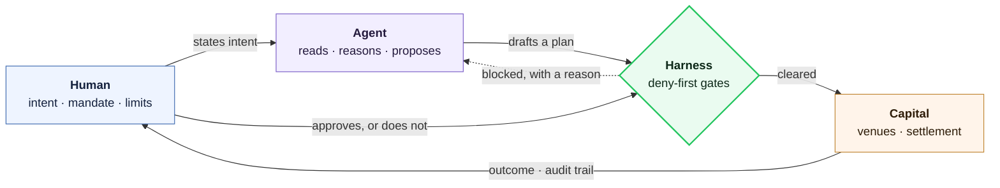

<div align="center">

# T I B E R I U &nbsp;&nbsp; T O C A

**The orchestration layer for the agentic economy.**

Romanian solo founder · [General Liquidity](https://generalliquidity.com), an applied product and research lab

[generalliquidity.com](https://generalliquidity.com) · [gordoncli.com](https://gordoncli.com) · [@tiberiu_toca](https://x.com/tiberiu_toca) · [LinkedIn](https://www.linkedin.com/in/tiberiu-aurelian-toca-80b88a200/)

</div>

<br />

> I am interested in ambitious, slightly illegible ideas before they become consensus.

<br />

## The thesis

In markets, AI does not have a capability problem. It has an authority problem.

A model that reads a chart fluently still cannot be trusted to size a position, respect a limit, or recover from a failed order. In most software, being slightly wrong is survivable. Where money moves, being *nearly* right is just being wrong with a settlement attached. The scarce thing was never intelligence. It is the layer that decides which intentions become actions: permissions, approvals, durable memory, disciplined execution, and legible failure.

That layer is missing, and it is what I build. Not smarter agents. The substrate that lets a human safely delegate consequence to one.

I hold a long-term thesis about how humans, capital, and agents will interact in the next economy, and I am building General Liquidity from that thesis rather than toward a market that already exists.



**The model proposes. The harness disposes.** Every product below is a version of that sentence, applied to a domain where being wrong is expensive.

<br />

## General Liquidity

Trading is the first vertical, not the mission. The lab ships an applied flagship and the open research infrastructure around it.

| | | |
|:--|:--|:--|
| **[Gordon](https://github.com/general-liquidity/gordon)** | A plan-first AI trading agent bringing institutional-grade discipline to retail traders. You state intent in plain language, it drafts a structured plan, you approve it, and a deny-first risk harness gates every order before it reaches a venue. | `TypeScript` `MIT` |
| **[SharpeBench](https://github.com/general-liquidity/sharpebench)** | A luck-robust benchmark for AI trading agents. Ranks risk-adjusted skill that survives deflation, not raw return. Ships as a [CLI](https://www.npmjs.com/package/@general-liquidity/sharpebench) and an [MCP server](https://www.npmjs.com/package/@general-liquidity/sharpebench-mcp). | `Rust` `npm` |
| **[SharpeArena](https://github.com/general-liquidity/sharpearena)** | A leak-free, point-in-time reinforcement-learning environment for trading agents, and the language-agnostic contract they speak. | `Python` |
| **[The API](https://github.com/general-liquidity/general-liquidity-openapi)** | One surface over payment, commerce, identity, and provenance, governed by a spend gate agents cannot bypass. SDKs in [TypeScript](https://github.com/general-liquidity/general-liquidity-typescript), [Python](https://github.com/general-liquidity/general-liquidity-python), [Rust](https://github.com/general-liquidity/general-liquidity-rust), [Go](https://github.com/general-liquidity/general-liquidity-go), plus an [MCP server](https://github.com/general-liquidity/general-liquidity-mcp) and a [CLI](https://github.com/general-liquidity/general-liquidity-cli). | `OpenAPI 3.1` |

```console
$ npm install -g @general-liquidity/gordon
```

<br />

## Verifier-first harnesses

The same architecture, carried into other domains where a confident wrong answer is worse than no answer. Each one puts a machine-checkable verifier between the model and the artifact.

| | | |
|:--|:--|:--|
| **[Theoremata](https://github.com/ReverseZoom2151/theoremata)** | The AI mathematician that breaks conjectures before proving them, discharges every step inside a proof assistant, and hands you a proof you can check yourself. | `Rust` |
| **[HarnessCAD](https://github.com/ReverseZoom2151/harnesscad)** | The verifier-first text-to-CAD agent harness, with a computer-using agent for 3D CAD generation in real GUIs, and Parts-Driven Development. | `Python` |
| **[HarnessBIM](https://github.com/ReverseZoom2151/harnessbim)** | The first fully-native, open-source text-to-BIM agentic harness: natural language to standards-compliant IFC, with no proprietary authoring tool in the loop. | `Python` |

<br />

## About

I am a philosopher-builder and contrarian at heart: part technologist, part systems thinker, part obsessive founder. I studied Computer Science with Innovation at the University of Bristol (MEng), then spent the last year or so moving through hacker houses, founder fellowships, and builder ecosystems across Europe, the US, and MENA.

Coming from Eastern Europe shaped my relationship with grit, resourcefulness, and perseverance, and made me comfortable operating outside obvious institutions. That is mostly an advantage. The ideas worth working on are rarely the ones with an established venue, and the people who find them early are usually the ones who did not need permission to start.

What holds my attention: AI agents, financial infrastructure, coordination systems, and tools that expand human agency. I build with intellectual grounding first, because a product with a thesis behind it can survive being early, and one without a thesis can only survive being right.

<br />

<div align="center">

**Building the orchestration layer for the agentic economy.**

[generalliquidity.com](https://generalliquidity.com) · [@tiberiu_toca](https://x.com/tiberiu_toca) · [LinkedIn](https://www.linkedin.com/in/tiberiu-aurelian-toca-80b88a200/)

</div>
